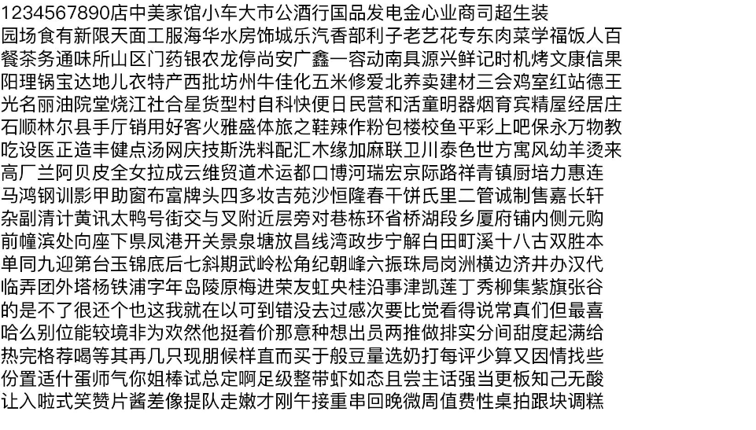
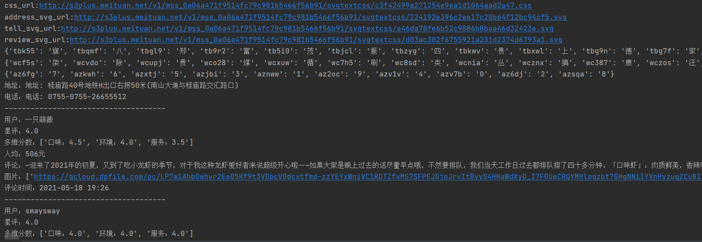
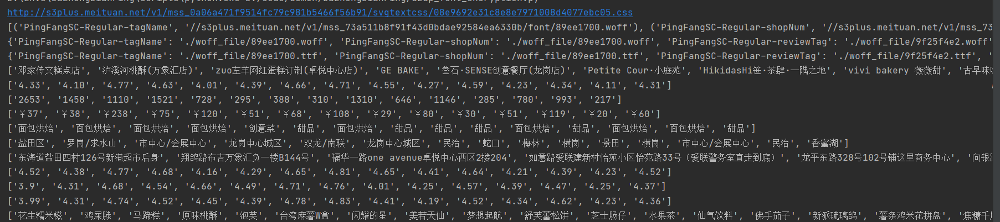

# 大众点评信息爬取

**声明：项目内容不得用于商业用途，仅做学习交流，如果侵犯了您的利益和权益，请邮箱联系我，我将删除该项目。**

**声明：项目内容不得用于商业用途，仅做学习交流，如果侵犯了您的利益和权益，请邮箱联系我，我将删除该项目。**

**声明：项目内容不得用于商业用途，仅做学习交流，如果侵犯了您的利益和权益，请邮箱联系我，我将删除该项目。**

| 作者    | 邮箱                 |
| ------- | -------------------- |
| liberty | fthemuse@foxmail.com |

------

## 1. 项目介绍

**该项目只对大众点评字体加密做了处理**

字体加密分以下两种：

1. CSS 字体映射（评论详情页：http://www.dianping.com/shop/G9TSD2JvdLtA7fdm/review_all）；
2. WOFF 字体加密（店铺搜索页面：http://www.dianping.com/shenzhen/ch10/g117）；


项目中使用了 `woff2tff.py`  将 woff 字体文件转为 ttf 字体文件，该文件来自：https://github.com/hanikesn/woff2otf

ttf 字体文件通过 fontTools 库生成如下图片，之后使用 pytesseract 识别汉字，动态生成码表




## 2. 效果展示

### 2.1 CSS 字体映射

`dzdp_css_map.py`




### 2.2 WOFF 字体加密

`dzdp_font_encryption.py`




## 3. 环境依赖

### 3.1 python

```
pip3 install -r requirements.txt -i https://pypi.douban.com/simple
```


### 3.2 pytesseract

- pytesseract 下载地址：https://digi.bib.uni-mannheim.de/tesseract/tesseract-ocr-w64-setup-v5.0.0-alpha.20200328.exe
- 安装完成后，新增系统变量： `TESSDATA_PREFIX: C:\Program Files\Tesseract-OCR` (安装目录)
- 修改 `当前 python 解释器所在目录\Lib\site-packages\pytesseract\pytesseract.py` 中的 `tesseract_cmd`  变量值为 `tesseract_cmd = r'C:\Program Files\Tesseract-OCR\tesseract.exe'`
- 下载简体中文训练集（https://raw.githubusercontent.com/tesseract-ocr/tessdata/4.00/chi_sim.traineddata），并拷贝到 `C:\Program Files\Tesseract-OCR\tessdata`  目录下


## 4. 分析过程

详见：`https://blog.csdn.net/saberqqq/article/details/105977645`